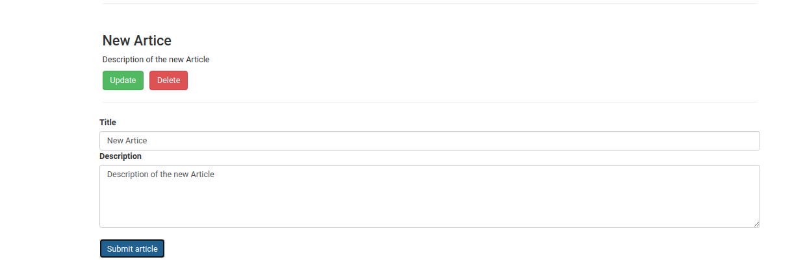

# Fullstack Django-React 
   
<table>
  <tr>
    <td>Register</td>
  </tr>
  <tr>
    <td></td>
  </tr>
    <tr>
    <td>Login</td>
  </tr>
  <tr>
    <td> </td>
  </tr>
  <tr>
    <td>Article list, Udating and Insertion</td>
  </tr>
  <tr>
    <td></td>
  </tr>
 </table>

   

### About the project
In this pet project, I have learnt and practiced integration of Django in the backend and React in the front end.
This project demonstrate various concepts off Django Rest Framework and React. My concepts on these are way more clearer than ever. I feel confident and now interested in more fullstack project.

### Stacks

  - Python
  - Django
  - Django Rest Framework
  - React
  - Version Control System(Git/GitHub)

### Features
 - User Registration,Login  with API
 - User Registration,Login  with React in the front end
 - Display List of Articles
 - Full CRUD functionality on the front end backed by Django-DRF
 

